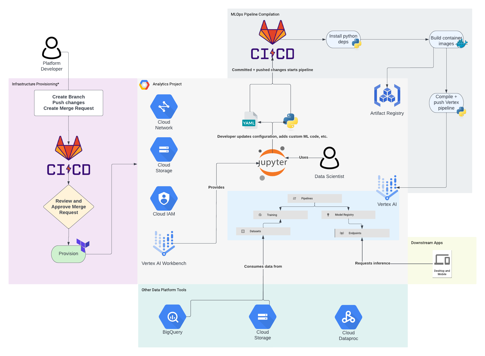

# Data Analytics Workbench

Welcome to the data analytics workbench (DAW)! DAW is an accelerator intended to
get you and your team up-and-running with a configurable MLOps pipeline that 
runs on Google Cloud's Vertex AI.

DAW is split into two foundational parts:
1. Infrastructure as code (IaC) to create a Vertex AI workbench (and other 
necessary components)
2. A configurable Python framework to help quickly build Vertex AI pipelines 
featuring common components.

Both foundational parts have contiunous improvement and delivery pipelines 
(CI/CD) to help you introduce and deploy changes to your ML workloads.

This repository, of course, contains the Python framework (component 2).

The below diagram aims to show how everything fits together; note that the
services in the "Other Data Platform Tools" section 
are assumed to already exist and the integration to them will need to be 
configured and potentially developed accordingly:

## Getting Started

This accelerator caters to two major use cases, and the setup differs for each:
1. Creating an MLOps pipeline for AutoML
2. Creating an MLOps pipeline for a custom training job

### Creating an MLOps pipeline for AutoML
